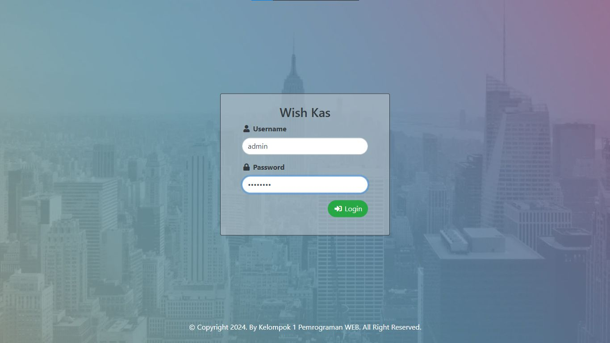
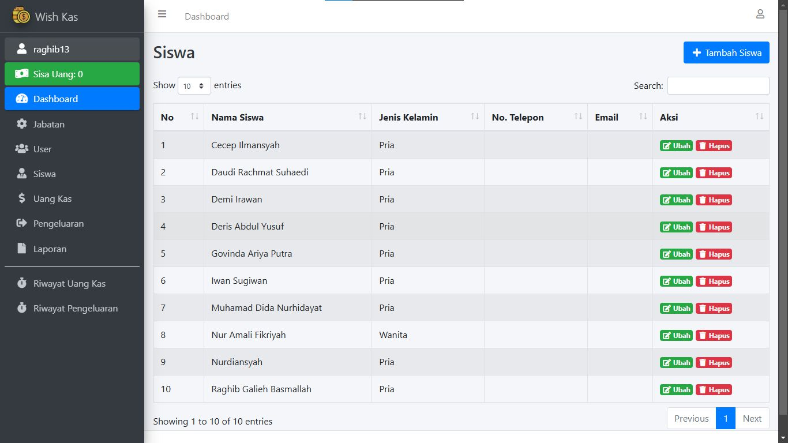

# Wish - Kas
#### Pencatatan Digital Uang Kas

Wish - Kas adalah aplikasi web pencatatan digital uang kas kampus kelas Intensif Mayora - 3 (MY3) Prodi Teknologi Informasi Universitas Tangerang Raya. Aplikasi ini memudahkan dalam memonitoring dan pengelolaan data kas.

## Fitur

- Melihat Informasi Saldo, Pemasukan, dan Pengeluaran
- Mengelola Pemasukan (add, edit, delete)
- Mengelola Pengeluaran (add, edit, delete)
- Mencari Daftar Transaksi berdasarkan tanggal dipilih
- Download Laporan Transaksi Keuangan dalam Format PDF

## Sistem Requirement
- Database : MySQL
- Server : XAMPP
- PHP 8.4

## Tampilan Halaman Home

## Tampilan Halaman Admin

## Kontribusi

